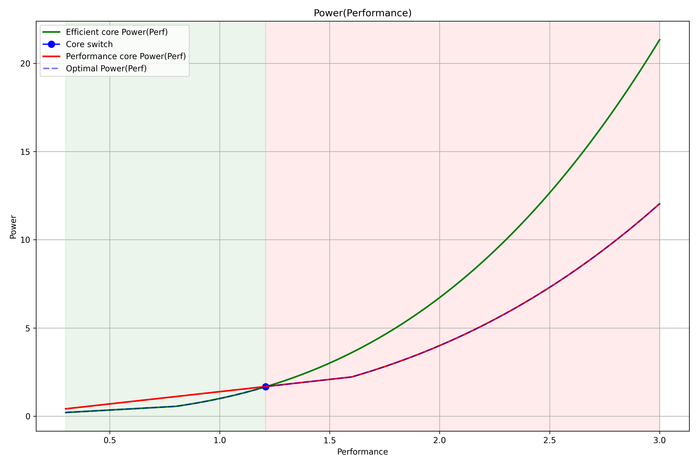

# Heterogeneous Architecture Power Model

# Architecture Assumptions

| Property | Efficient Core | Performance Core |
|---|---|---|
| Capacitance coefficient `C` | `1` | `4` |
| IPC | `1` | `2` |
| Performance model | `Perf(f) = f` | `Perf(f) = 2f` |

# Power Model

$P = C U^2 f$

where:

- `C` — effective capacitance
- `U` — voltage
- `f` — frequency

---

# Voltage–Frequency Relation

Assume a linear dependency between voltage and frequency:

$f = kU + b, U \ge U_{min}$

Boundary conditions:

- when `f = 1`, `U = 1.2`
- when `f = 1.8`, `U = 2`

Substituting:

$1 = 1.2k + b$

$1.8 = 2k + b$

Solution:

$k = 1$

$b = -0.2$

Thus:

$f = U - 0.2$

$U = f + 0.2$

Finally:

$
\begin{cases}
U = U_{min}, & f \leq 0.8 \\
U = f + 0.2, & f > 0.8
\end{cases}
$

Where

$U_{min} = 1$

---

# Efficient Core Power Function

Substitute:

$U = max(f + 0.2, U_{min})$

into:

$P = C U^2 f$

For efficient cores:

- $C = 1$
- $Perf = f$

Substitute and normalize: $Power = 1$ when $Perf = 1$, $C = 1$

Therefore:

$$Power_{Eff}(Perf) = \begin{cases}
    \dfrac{Perf}{1.44}, & Perf \leq 0.8 \\[8pt]
    \dfrac{Perf(Perf + 0.2)^2}{1.44}, & Perf > 0.8
\end{cases}$$

---

# Performance Core Power Function

For performance cores:

- $C = 4$
- $Perf = 2f$ -> $f = \frac{Perf}{2}$

Therefore for normalized formula:

$$Power_{Perf}(Perf) = \begin{cases}
    \dfrac{2 * Perf}{1.44}, & Perf \leq 1.6 \\[8pt]
    \dfrac{4 \cdot \dfrac{Perf}{2} \cdot \left(\dfrac{Perf}{2}+0.2\right)^2}{1.44}, & Perf > 1.6 \\[8pt]
\end{cases}
$$

---

# Power(Perf) plot

