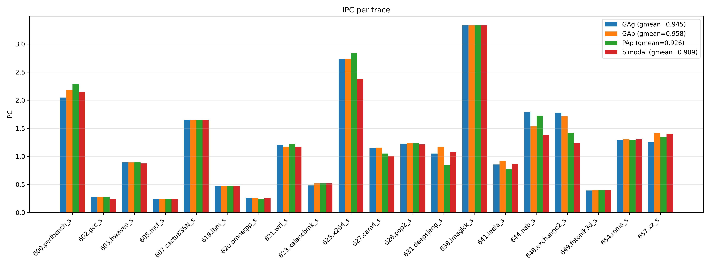
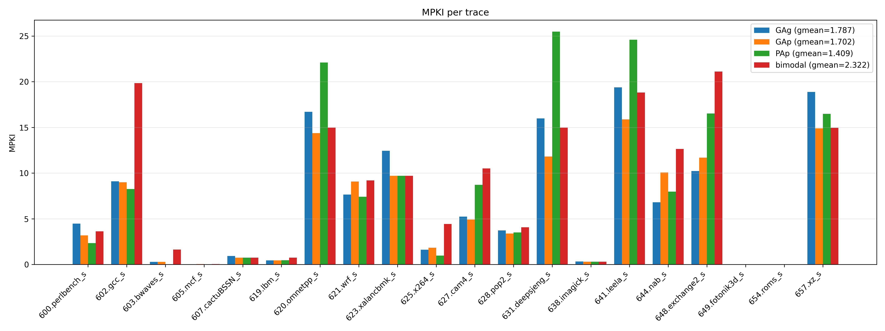

# Branch predictors comparison

Implemented and evaluated **GAg**, **GAp**, **PAp**, **bimodal** branch predictors on 20 [SPEC CPU 2017 traces](https://dpc3.compas.cs.stonybrook.edu/champsim-traces/speccpu/) using ChampSim.

Trace list:
- 600.perlbench_s-1273B.champsimtrace.xz
- 602.gcc_s-1850B.champsimtrace.xz
- 603.bwaves_s-2931B.champsimtrace.xz
- 605.mcf_s-1536B.champsimtrace.xz
- 607.cactuBSSN_s-2421B.champsimtrace.xz
- 619.lbm_s-2676B.champsimtrace.xz
- 620.omnetpp_s-141B.champsimtrace.xz
- 621.wrf_s-575B.champsimtrace.xz
- 623.xalancbmk_s-165B.champsimtrace.xz
- 625.x264_s-12B.champsimtrace.xz
- 627.cam4_s-490B.champsimtrace.xz
- 628.pop2_s-17B.champsimtrace.xz
- 631.deepsjeng_s-928B.champsimtrace.xz
- 638.imagick_s-10316B.champsimtrace.xz
- 641.leela_s-149B.champsimtrace.xz
- 644.nab_s-12459B.champsimtrace.xz
- 648.exchange2_s-387B.champsimtrace.xz
- 649.fotonik3d_s-1176B.champsimtrace.xz
- 654.roms_s-293B.champsimtrace.xz
- 657.xz_s-4994B.champsimtrace.xz


## Predictors

| Predictor | Description | PHT size | Total size |
|-----------|-------------|----------|------------|
| **bimodal** | Single 2-bit saturating counter per PC | 16384 × 2bit | **32 Kbit (4 KB)** |
| **GAg** | Global history register + single shared PHT | 2^14 × 2bit | **32 Kbit (4 KB)** |
| **GAp** | Global history register + per-PC PHT | 128×128 × 2bit | **32 Kbit (4 KB)** |
| **PAp** | Per-branch history register + per-PC PHT | 128×128 × 2bit + 128×7bit BHT | **32 Kbit + 896 bit ≈ 4.1 KB** |

## Results

### IPC



### MPKI



| Predictor | IPC       | MPKI      |
|-----------|-----------|-----------|
| GAg       | 0.945     | 1.787     |
| GAp       | **0.958** | 1.702     |
| PAp       | 0.926     | **1.409** |
| bimodal   | 0.909     | 2.322     |

## Discussion

On GMEAN over 20 traces, all history-based predictors outperform bimodal at equal storage — bimodal ignores branch history entirely and aliases all branches with the same PC bits.

**GAg vs bimodal**: GAg has a 14-bit global history register. The shared PHT captures common branch patterns, reducing GMEAN MPKI from 2.322 to 1.787. However, the single shared PHT causes aliasing between different branches.

**GAp vs GAg**: Adding PC lower 7 bits to the PHT index reduces aliasing between different branches. MPKI drops to 1.702 — as expected since PC+history is a stronger index than shared history alone.

**PAp vs GAp**: Different branch history registers for different PCs eliminates cross-branch history pollution entirely. PAp achieves the best MPKI == 1.409 but lower IPC than GAp. PAp loses to GAp on IPC on some benchmarks, e.g. 631.deepsjeng, 641.leela, 627.cam4_s etc. Because PAp can not handle correlation between different branches.

## How to build and run
### Simulation
```bash
# Build with a specific predictor (GAg / GAp / PAp / bimodal)
cd ChampSim
./config.sh champsim_config.json   # set "branch_predictor" in config first
make

# Run simulation on all traces
bash ../run_sim.sh <champsim> <tracedir> <resdir>
```

### Analysis

```bash
uv run --with matplotlib --with numpy analyze.py
# outputs: results/ipc.png, results/mpki.png
```
