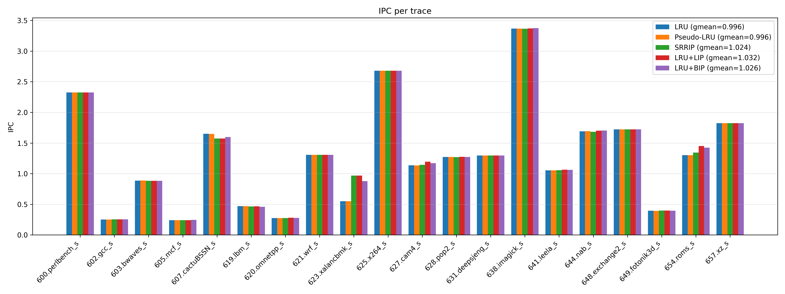
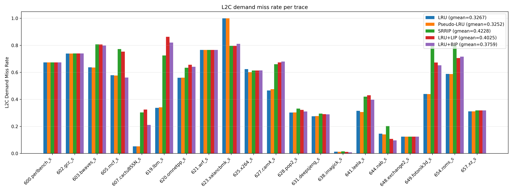

# Cache replacement policies comparison

Implemented and evaluated **LRU**, **Pseudo-LRU**, **SRRIP**, **LRU+LIP**, **LRU+BIP** on 20 [SPEC CPU 2017 traces](https://dpc3.compas.cs.stonybrook.edu/champsim-traces/speccpu/) using ChampSim. Metrics: IPC and L2 cache miss rate (total misses / total accesses).

Trace list:
- 600.perlbench_s-1273B.champsimtrace.xz
- 602.gcc_s-1850B.champsimtrace.xz
- 603.bwaves_s-2931B.champsimtrace.xz
- 605.mcf_s-1536B.champsimtrace.xz
- 607.cactuBSSN_s-2421B.champsimtrace.xz
- 619.lbm_s-2676B.champsimtrace.xz
- 620.omnetpp_s-141B.champsimtrace.xz
- 621.wrf_s-575B.champsimtrace.xz
- 623.xalancbmk_s-165B.champsimtrace.xz
- 625.x264_s-12B.champsimtrace.xz
- 627.cam4_s-490B.champsimtrace.xz
- 628.pop2_s-17B.champsimtrace.xz
- 631.deepsjeng_s-928B.champsimtrace.xz
- 638.imagick_s-10316B.champsimtrace.xz
- 641.leela_s-149B.champsimtrace.xz
- 644.nab_s-12459B.champsimtrace.xz
- 648.exchange2_s-387B.champsimtrace.xz
- 649.fotonik3d_s-1176B.champsimtrace.xz
- 654.roms_s-293B.champsimtrace.xz
- 657.xz_s-4994B.champsimtrace.xz

## Policies

All five policies share the same eviction and promotion logic — they only differ in where a new cache entry is inserted:

| Policy | Inserts new cache entry at |
|---|---|
| LRU | MRU — assume it's hot |
| Pseudo-LRU | MRU — tree-based approximation of LRU |
| SRRIP | Near-distant (RRPV = max−1) — assume it's cold |
| LRU+LIP | LRU — immediately evictable unless hit |
| LRU+BIP | LRU, but ~1/32 fills go to MRU instead |

## Results

### IPC



### L2C Miss Rate



| Policy | GMEAN IPC | GMEAN L2C Miss Rate |
|---|---|---|
| LRU | 0.9963 | 0.3267 |
| Pseudo-LRU | 0.9960 | 0.3252 |
| SRRIP | 1.0236 | 0.4228 |
| LRU+LIP | **1.0323** | 0.4025 |
| LRU+BIP | 1.0255 | **0.3759** |

## Discussion

**LRU vs Pseudo-LRU**: show very similar results across all benchmarks, that shows that memory less model of pseudo-LRU behaves almost like baseline LRU.

**LRU vs SRRIP**: SRRIP inserts new lines at near-distant position instead of MRU, so they are evicted first if not reused. The biggest win is `623.xalancbmk`: IPC 0.551 → 0.969 (+76%), a workload that walks large data structures once and pollutes the cache under LRU. `654.roms` (+3.2%) and `620.omnetpp` (+0.3%) also benefit. The cost is higher miss rate on streaming benchmarks (`619.lbm`, `603.bwaves`) where lines do get reused but SRRIP ages them out too aggressively.

**LRU vs LRU+LIP**: LIP is the extreme version — new lines go straight to LRU position and are evicted immediately if not hit. Best GMEAN IPC overall (1.0323, +3.6%), with the same gains as SRRIP on `623.xalancbmk` and additional improvements on `654.roms` (+11.4%) and `627.cam4` (+5.1%). Higher miss rate is expected and not a problem — the misses are on cold lines that would never have been reused anyway.

**LRU+LIP vs LRU+BIP**: BIP inserts at LRU position but sends ~1/32 fills to MRU instead. This lets the cache adapt during phase transitions between streaming and reuse-heavy access patterns. BIP slightly underperforms LIP on pure scan workloads but recovers on mixed ones like `607.cactuBSSN` (1.597 vs 1.573) and achieves the best GMEAN miss rate overall (0.3759).

## How to build and run
### Simulation
```bash
# Build with a specific L2 cache policy (LRU, Pseudo-LRU, SRRIP, LRU+LIP, LRU+BIP)
cd ChampSim
./config.sh champsim_config.json   # set "L2C": "replacement" in config first
make

# Run simulation on all traces
bash ../run_sim.sh <champsim> <tracedir> <resdir>
```

### Analysis

```bash
uv run --with matplotlib --with numpy analyze.py
# outputs: results/ipc.png, results/miss_rate.png
```
